# 🎸 FLOWCHARTS-DIAGRAM.md - Hurtrock Music Store

Dokumentasi lengkap flowchart dan diagram untuk sistem e-commerce alat musik Hurtrock Music Store dengan arsitektur Flask-only dan chat service Django.

## 📊 Daftar Isi

1. [Arsitektur Sistem](#arsitektur-sistem)
2. [Entity Relationship Diagram (ERD)](#entity-relationship-diagram-erd)
3. [Data Flow Diagram (DFD)](#data-flow-diagram-dfd)
4. [Use Case Diagram](#use-case-diagram)
5. [Customer Journey Flowchart](#customer-journey-flowchart)
6. [Admin Workflow Flowchart](#admin-workflow-flowchart)
7. [Order Processing Flowchart](#order-processing-flowchart)
8. [Payment Processing Flowchart](#payment-processing-flowchart)
9. [Authentication Flow](#authentication-flow)
10. [Cart Management Flow](#cart-management-flow)
11. [Product Management Flow](#product-management-flow)
12. [Inventory Management Flow](#inventory-management-flow)
13. [Chat System Flow](#chat-system-flow)
14. [Error Handling Flow](#error-handling-flow)
15. [Deployment Architecture](#deployment-architecture)

---

## 🏗️ Arsitektur Sistem

### Flask-Only Architecture dengan Chat Service

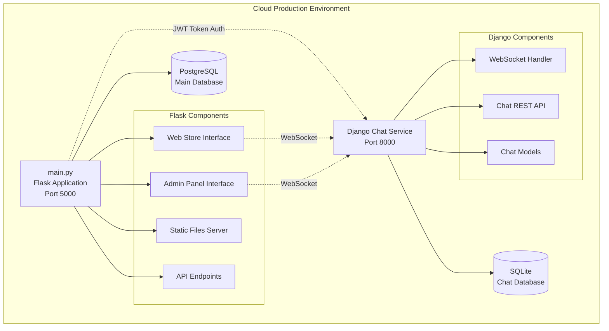

### Component Layer Architecture

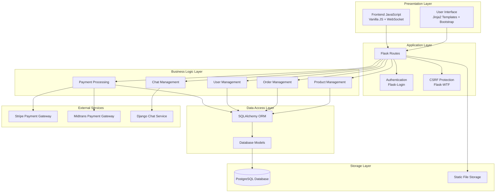

---

## 🗃️ Entity Relationship Diagram (ERD)

### Complete Database Schema

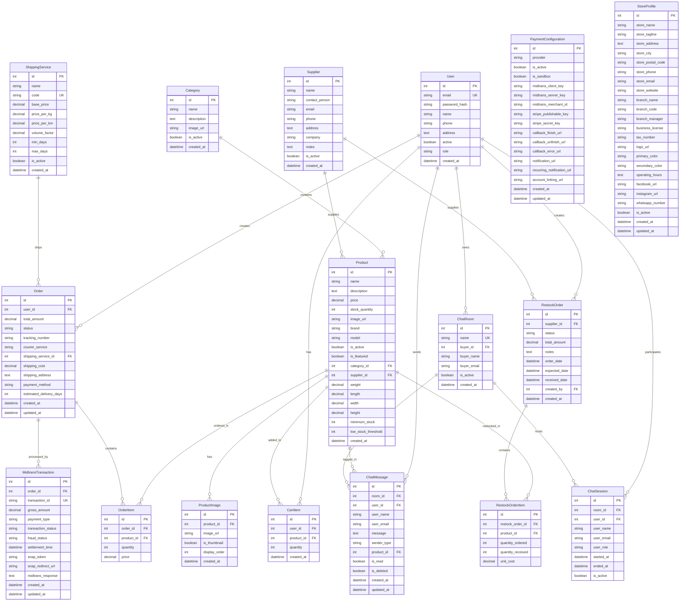

---

## 📊 Data Flow Diagram (DFD)

### Level 0 - Context Diagram

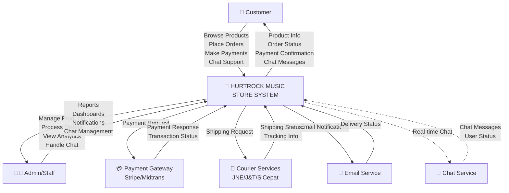

### Level 1 - System Decomposition

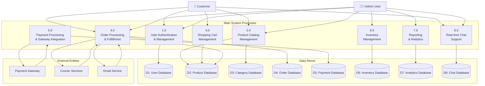

### Level 2 - Order Processing Detail

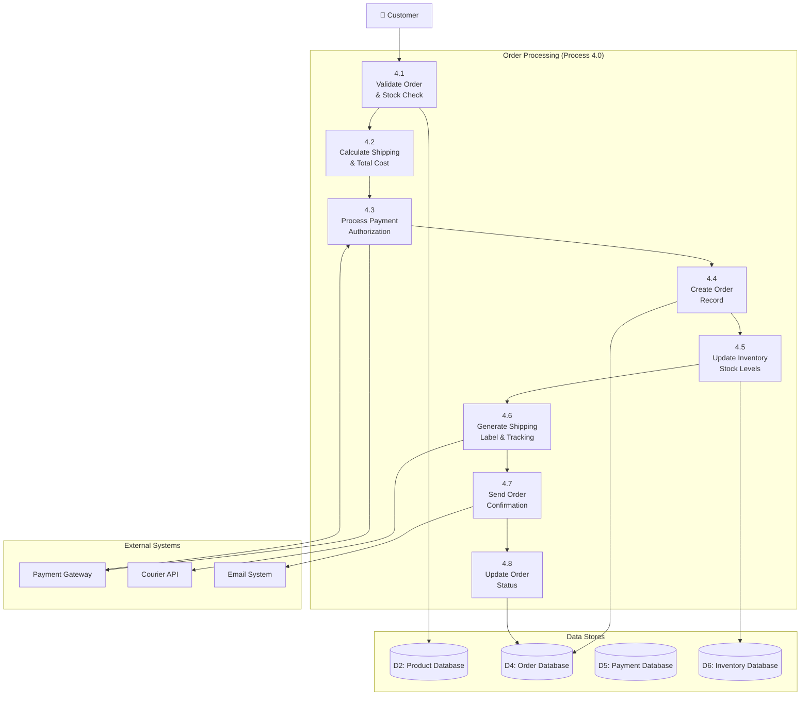

---

## 👥 Use Case Diagram

### Complete System Use Cases

```mermaid
graph TB
    subgraph "Actors"
        Customer[👤 Customer<br/>Buyer Role]
        Admin[👨‍💼 Admin<br/>Admin Role]
        Staff[👩‍💼 Staff<br/>Staff Role]
        PaymentGW[💳 Payment Gateway]
        CourierSys[🚚 Courier System]
    end

    subgraph "Customer Use Cases"
        UC1[Browse Products & Categories]
        UC2[Search Products]
        UC3[View Product Details]
        UC4[Manage Shopping Cart]
        UC5[User Registration & Login]
        UC6[Manage User Profile]
        UC7[Checkout & Payment]
        UC8[Track Orders]
        UC9[View Order History]
        UC10[Switch Light/Dark Theme]
        UC11[Chat with Support]
        UC12[Rate & Review Products]
    end

    subgraph "Admin Use Cases"
        UC13[Manage Products & Categories]
        UC14[Upload Product Images]
        UC15[Manage Users & Roles]
        UC16[Process Orders]
        UC17[Update Order Status]
        UC18[Generate Shipping Labels]
        UC19[View Analytics & Reports]
        UC20[Export Sales Data]
        UC21[Manage Suppliers]
        UC22[Manage Payment Config]
        UC23[Manage Shipping Services]
        UC24[Configure Store Profile]
        UC25[Handle Chat Support]
        UC26[Inventory Management]
        UC27[Restock Orders]
    end

    subgraph "Staff Use Cases"
        UC28[View Orders]
        UC29[Update Order Status]
        UC30[Print Shipping Labels]
        UC31[View Basic Analytics]
        UC32[Handle Customer Chat]
    end

    subgraph "System Integration"
        UC33[Process Payment]
        UC34[Send Payment Notifications]
        UC35[Calculate Shipping Cost]
        UC36[Track Package Status]
        UC37[Send Email Notifications]
    end

    %% Customer connections
    Customer --> UC1
    Customer --> UC2
    Customer --> UC3
    Customer --> UC4
    Customer --> UC5
    Customer --> UC6
    Customer --> UC7
    Customer --> UC8
    Customer --> UC9
    Customer --> UC10
    Customer --> UC11
    Customer --> UC12

    %% Admin connections
    Admin --> UC13
    Admin --> UC14
    Admin --> UC15
    Admin --> UC16
    Admin --> UC17
    Admin --> UC18
    Admin --> UC19
    Admin --> UC20
    Admin --> UC21
    Admin --> UC22
    Admin --> UC23
    Admin --> UC24
    Admin --> UC25
    Admin --> UC26
    Admin --> UC27

    %% Staff connections  
    Staff --> UC28
    Staff --> UC29
    Staff --> UC30
    Staff --> UC31
    Staff --> UC32

    %% External system connections
    UC7 --> UC33
    PaymentGW --> UC34
    UC7 --> UC35
    CourierSys --> UC36
    UC17 --> UC37

    %% Use case dependencies
    UC4 --> UC7
    UC7 --> UC8
    UC33 --> UC16
    UC16 --> UC17
    UC17 --> UC18
```

---

## 🛍️ Customer Journey Flowchart

### Complete Customer Experience Flow

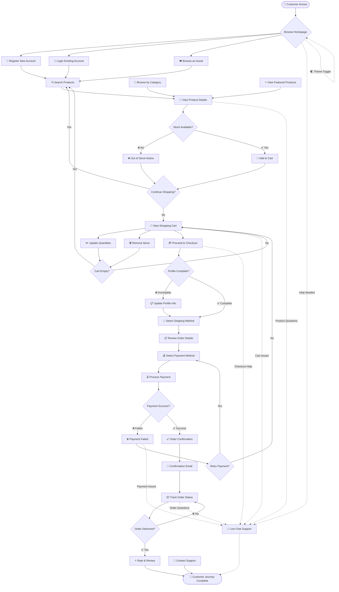

### Customer State Transitions

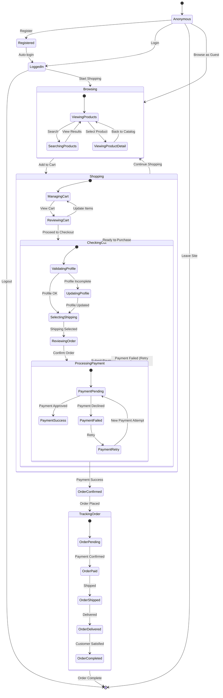

---

## 👨‍💼 Admin Workflow Flowchart

### Admin Dashboard Flow

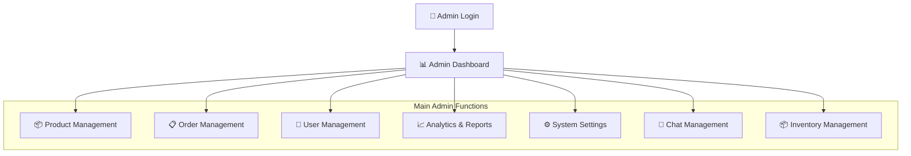

### Product Management Flow

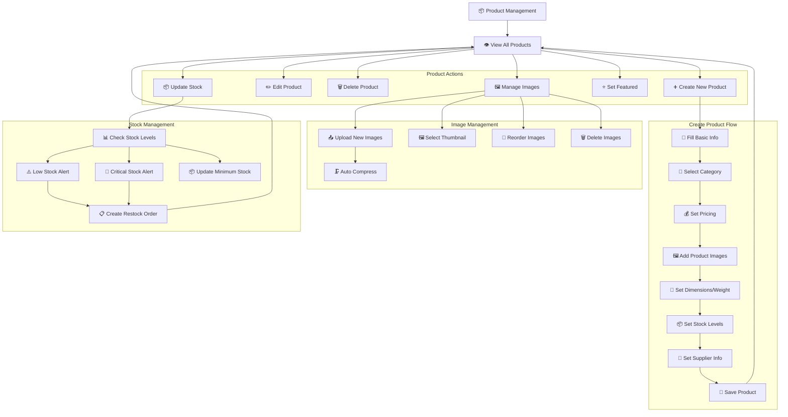

### Order Management Flow

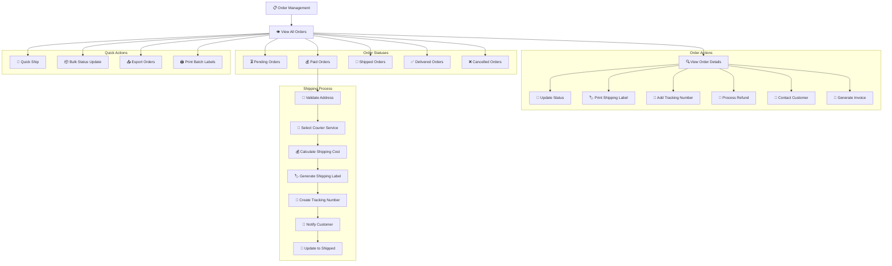

---

## 📋 Order Processing Flowchart

### Complete Order Lifecycle

```mermaid
flowchart TD
    OrderReceived([📝 New Order Received])

    subgraph "Order Validation"
        ValidateOrder[🔍 Validate Order Data]
        CheckCustomer[👤 Verify Customer Info]
        ValidateItems[📦 Validate Order Items]
        OrderValid{Order Valid?}
        RejectOrder[❌ Reject Order]
        SendRejectionEmail[📧 Send Rejection Email]
    end

    subgraph "Stock Verification"
        CheckStock[📦 Check Stock Availability]
        StockAvailable{All Items Available?}
        ReserveStock[📌 Reserve Stock Items]
        PartialStock[⚠️ Partial Stock Available]
        BackorderItems[📋 Create Backorder]
        NotifyStockIssue[📧 Notify Stock Issues]
    end

    subgraph "Payment Processing"
        ValidatePayment[💳 Validate Payment Method]
        ProcessPayment[⏳ Process Payment]
        PaymentSuccess{Payment Successful?}
        PaymentFailed[❌ Payment Failed]
        NotifyPaymentFailure[📧 Payment Failure Notice]
        ConfirmPayment[✅ Confirm Payment]
        UpdateOrderStatus1[📊 Status: Paid]
    end

    subgraph "Order Fulfillment"
        GenerateInvoice[📄 Generate Invoice]
        AllocateInventory[📦 Allocate Inventory]
        PreparePackaging[📦 Prepare for Packaging]
        PackageOrder[📦 Package Items]
        WeighPackage[⚖️ Weigh Package]
        SelectCourier[🚚 Select Courier Service]
        GenerateShippingLabel[🏷️ Generate Shipping Label]
        CreateTrackingNumber[📍 Create Tracking Number]
        UpdateOrderStatus2[📊 Status: Shipped]
    end

    subgraph "Shipping & Delivery"
        HandoverToCourier[🚚 Handover to Courier]
        NotifyCustomerShipped[📧 Shipping Notification]
        TrackPackage[📍 Track Package Movement]
        UpdateDeliveryStatus[🔄 Update Delivery Status]
        PackageDelivered{Package Delivered?}
        DeliveryConfirmed[✅ Delivery Confirmed]
        UpdateOrderStatus3[📊 Status: Delivered]
        DeliveryFailed[❌ Delivery Failed]
        RetryDelivery[🔄 Schedule Retry]
        ContactCustomerDelivery[📧 Contact Customer]
    end

    subgraph "Post-Delivery"
        SendCompletionEmail[📧 Order Completion Email]
        RequestFeedback[⭐ Request Customer Feedback]
        ArchiveOrder[📁 Archive Order]
        UpdateAnalytics[📊 Update Sales Analytics]
        OrderComplete[✅ Order Complete]
    end

    subgraph "Exception Handling"
        OrderCancelled[❌ Order Cancelled]
        ProcessRefund[💸 Process Refund]
        RestoreStock[📦 Restore Stock Levels]
        NotifyCancellation[📧 Cancellation Notice]
    end

    OrderReceived --> ValidateOrder
    ValidateOrder --> CheckCustomer
    CheckCustomer --> ValidateItems
    ValidateItems --> OrderValid

    OrderValid -->|❌ Invalid| RejectOrder
    RejectOrder --> SendRejectionEmail
    SendRejectionEmail --> OrderComplete

    OrderValid -->|✅ Valid| CheckStock
    CheckStock --> StockAvailable

    StockAvailable -->|❌ Insufficient| PartialStock
    PartialStock --> BackorderItems
    BackorderItems --> NotifyStockIssue
    NotifyStockIssue --> OrderCancelled

    StockAvailable -->|✅ Available| ReserveStock
    ReserveStock --> ValidatePayment
    ValidatePayment --> ProcessPayment
    ProcessPayment --> PaymentSuccess

    PaymentSuccess -->|❌ Failed| PaymentFailed
    PaymentFailed --> NotifyPaymentFailure
    NotifyPaymentFailure --> OrderCancelled

    PaymentSuccess -->|✅ Success| ConfirmPayment
    ConfirmPayment --> UpdateOrderStatus1
    UpdateOrderStatus1 --> GenerateInvoice

    GenerateInvoice --> AllocateInventory
    AllocateInventory --> PreparePackaging
    PreparePackaging --> PackageOrder
    PackageOrder --> WeighPackage
    WeighPackage --> SelectCourier
    SelectCourier --> GenerateShippingLabel
    GenerateShippingLabel --> CreateTrackingNumber
    CreateTrackingNumber --> UpdateOrderStatus2

    UpdateOrderStatus2 --> HandoverToCourier
    HandoverToCourier --> NotifyCustomerShipped
    NotifyCustomerShipped --> TrackPackage
    TrackPackage --> UpdateDeliveryStatus
    UpdateDeliveryStatus --> PackageDelivered

    PackageDelivered -->|❌ Failed| DeliveryFailed
    DeliveryFailed --> RetryDelivery
    RetryDelivery --> ContactCustomerDelivery
    ContactCustomerDelivery --> TrackPackage

    PackageDelivered -->|✅ Success| DeliveryConfirmed
    DeliveryConfirmed --> UpdateOrderStatus3
    UpdateOrderStatus3 --> SendCompletionEmail
    SendCompletionEmail --> RequestFeedback
    RequestFeedback --> ArchiveOrder
    ArchiveOrder --> UpdateAnalytics
    UpdateAnalytics --> OrderComplete

    OrderCancelled --> ProcessRefund
    ProcessRefund --> RestoreStock
    RestoreStock --> NotifyCancellation
    NotifyCancellation --> OrderComplete

    OrderComplete --> End([🏁 Process End])
```

---

## 💳 Payment Processing Flowchart

### Multi-Gateway Payment Flow

```mermaid
flowchart TD
    InitiatePayment([💳 Initiate Payment])

    subgraph "Payment Configuration"
        GetActiveConfig[⚙️ Get Active Payment Config]
        ConfigExists{Config Available?}
        NoConfigError[❌ No Payment Config Available]
        SelectGateway[🎯 Select Payment Gateway]
        GatewayType{Gateway Type?}
    end

    subgraph "Stripe Payment Flow"
        StripeConfig[🟦 Stripe Configuration]
        CreateStripeSession[📝 Create Checkout Session]
        BuildLineItems[📋 Build Line Items]
        AddShipping[🚚 Add Shipping Cost]
        CreateSession[✨ Create Stripe Session]
        RedirectToStripe[🔗 Redirect to Stripe]
        StripeCallback[↩️ Stripe Callback]
        StripeWebhook[🔔 Stripe Webhook]
    end

    subgraph "Midtrans Payment Flow"
        MidtransConfig[🟨 Midtrans Configuration]
        GenerateOrderID[🆔 Generate Order ID]
        BuildItemDetails[📋 Build Item Details]
        SetCustomerDetails[👤 Set Customer Details]
        CreateTransaction[💼 Create Snap Transaction]
        GetSnapToken[🎫 Get Snap Token]
        RedirectToMidtrans[🔗 Redirect to Midtrans]
        MidtransCallback[↩️ Midtrans Callback]
        MidtransWebhook[🔔 Midtrans Notification]
    end

    subgraph "Payment Verification"
        VerifyPayment[🔍 Verify Payment Status]
        UpdateTransactionRecord[📝 Update Transaction Record]
        PaymentSuccessful{Payment Successful?}
        HandleSuccess[✅ Handle Success]
        HandleFailure[❌ Handle Failure]
        UpdateOrderStatus[📊 Update Order Status]
    end

    subgraph "Post-Payment Processing"
        ClearCart[🛒 Clear Shopping Cart]
        CreateOrderItems[📦 Create Order Items]
        UpdateInventory[📦 Update Inventory]
        SendConfirmation[📧 Send Confirmation Email]
        RedirectToSuccess[🎉 Redirect to Success Page]
        LogTransaction[📝 Log Transaction Details]
    end

    subgraph "Error Handling"
        PaymentError[⚠️ Payment Error]
        LogError[📝 Log Error Details]
        NotifyCustomer[📧 Notify Customer]
        ReturnToCart[🛒 Return to Cart]
        OfferRetry[🔄 Offer Payment Retry]
    end

    InitiatePayment --> GetActiveConfig
    GetActiveConfig --> ConfigExists
    ConfigExists -->|❌ No| NoConfigError
    ConfigExists -->|✅ Yes| SelectGateway
    SelectGateway --> GatewayType

    %% Stripe Flow
    GatewayType -->|Stripe| StripeConfig
    StripeConfig --> CreateStripeSession
    CreateStripeSession --> BuildLineItems
    BuildLineItems --> AddShipping
    AddShipping --> CreateSession
    CreateSession --> RedirectToStripe
    RedirectToStripe --> StripeCallback
    StripeCallback --> VerifyPayment

    %% Midtrans Flow
    GatewayType -->|Midtrans| MidtransConfig
    MidtransConfig --> GenerateOrderID
    GenerateOrderID --> BuildItemDetails
    BuildItemDetails --> SetCustomerDetails
    SetCustomerDetails --> CreateTransaction
    CreateTransaction --> GetSnapToken
    GetSnapToken --> RedirectToMidtrans
    RedirectToMidtrans --> MidtransCallback
    MidtransCallback --> VerifyPayment

    %% Webhook Handling
    StripeWebhook --> UpdateTransactionRecord
    MidtransWebhook --> UpdateTransactionRecord

    %% Payment Verification
    VerifyPayment --> UpdateTransactionRecord
    UpdateTransactionRecord --> PaymentSuccessful

    PaymentSuccessful -->|✅ Success| HandleSuccess
    PaymentSuccessful -->|❌ Failed| HandleFailure

    HandleSuccess --> UpdateOrderStatus
    UpdateOrderStatus --> ClearCart
    ClearCart --> CreateOrderItems
    CreateOrderItems --> UpdateInventory
    UpdateInventory --> SendConfirmation
    SendConfirmation --> RedirectToSuccess
    RedirectToSuccess --> LogTransaction

    HandleFailure --> PaymentError
    PaymentError --> LogError
    LogError --> NotifyCustomer
    NotifyCustomer --> ReturnToCart
    ReturnToCart --> OfferRetry

    NoConfigError --> PaymentError
    OfferRetry --> SelectGateway

    LogTransaction --> End([🏁 Payment Complete])
    OfferRetry --> End
```

### Payment Status State Machine

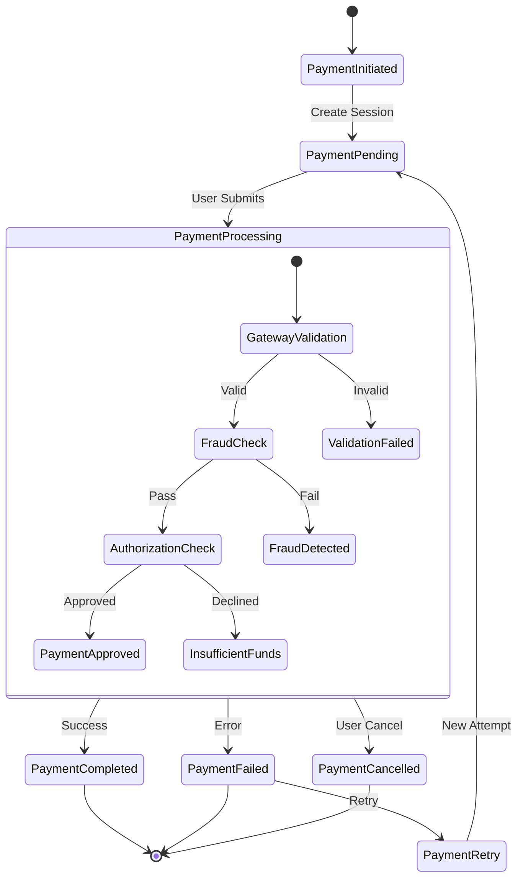

---

## 🔐 Authentication Flow

### User Authentication Process

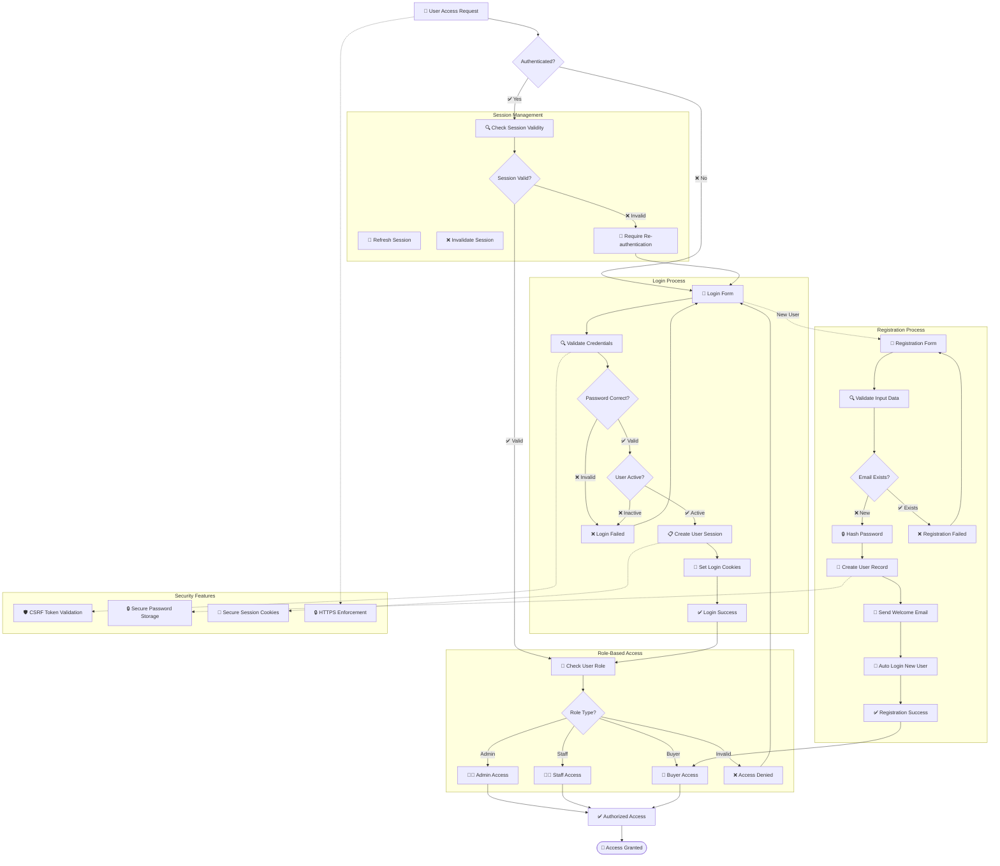

---

## 🛒 Cart Management Flow

### Shopping Cart Operations

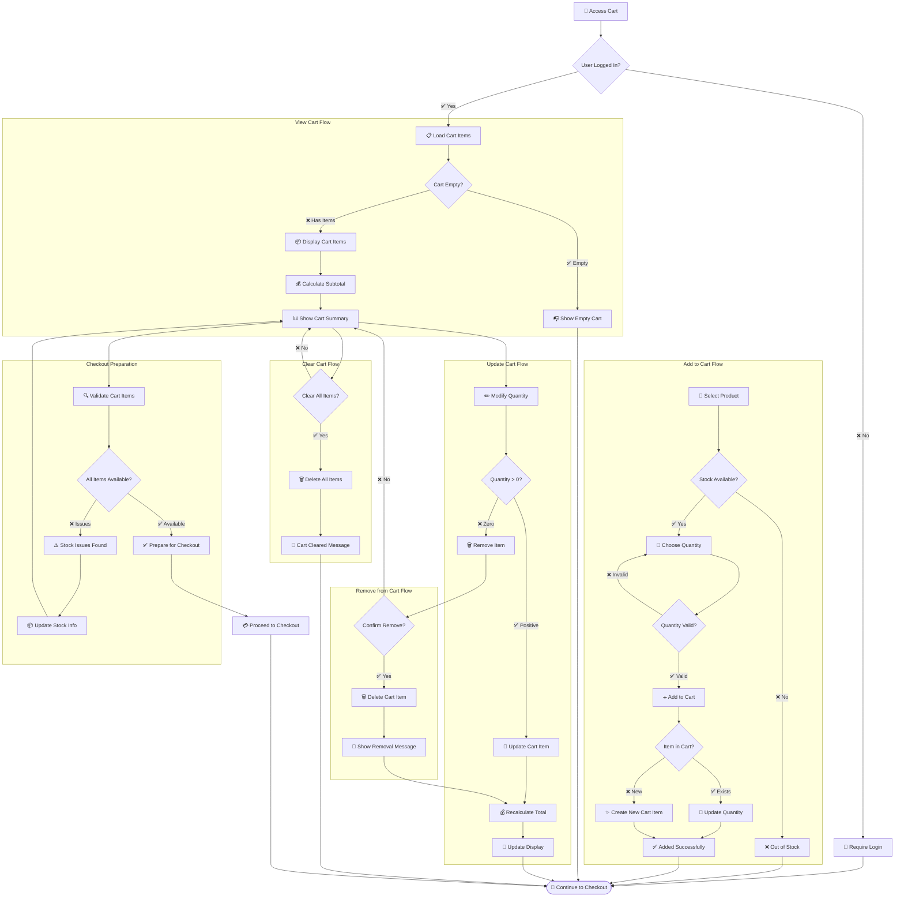

---

## 📦 Inventory Management Flow

### Stock Management System

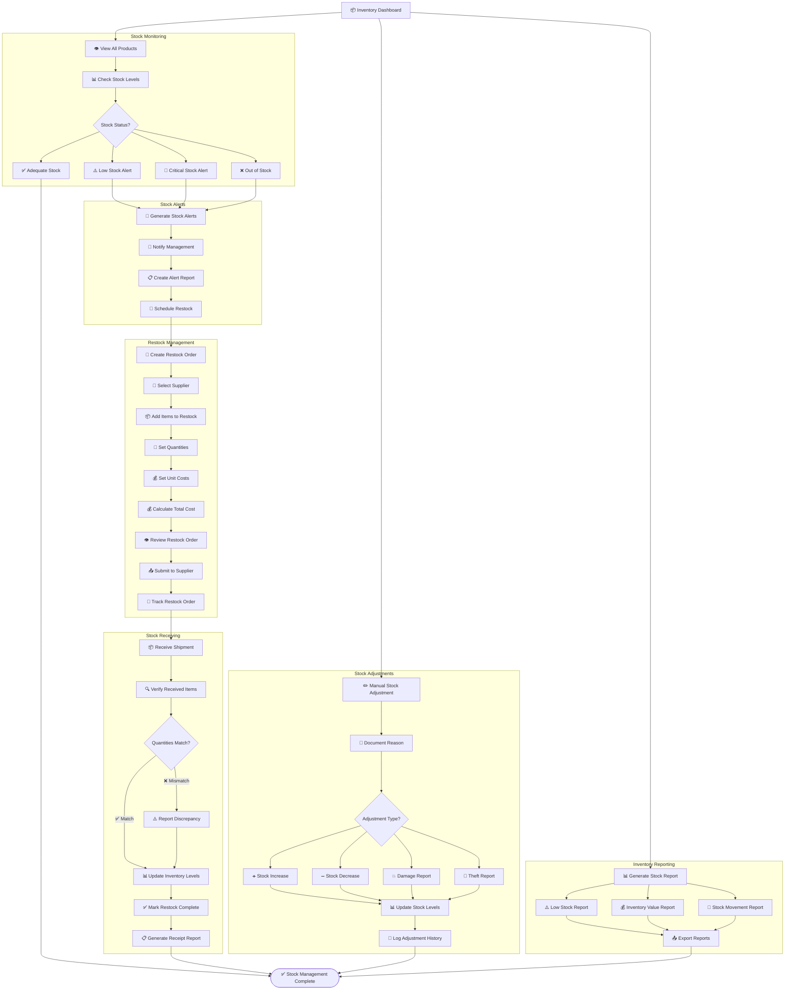

---

## 💬 Chat System Flow

### Real-time Chat Architecture

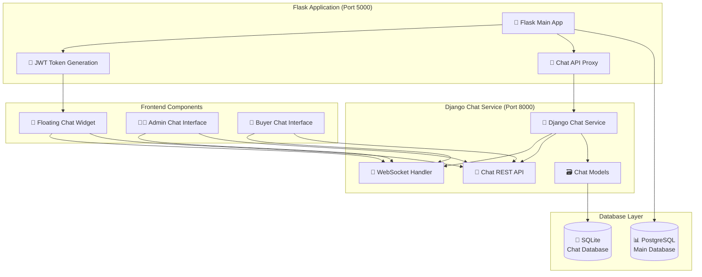

### Chat Message Flow

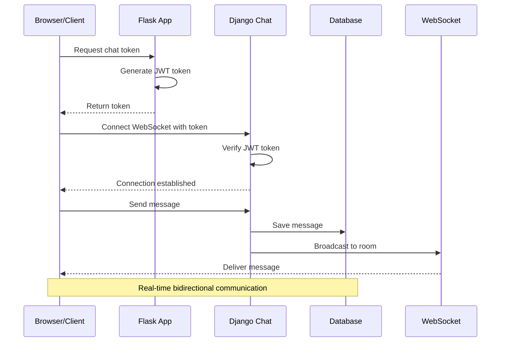

## Media Upload Flow

```mermaid
sequenceDiagram
    participant U as User
    participant F as Flask Upload API
    participant FS as File System
    participant D as Django Chat
    participant DB as PostgreSQL

    U->>F: POST /api/chat/upload-media
    F->>F: Validate file (size, type)
    F->>F: Generate unique filename
    F->>FS: Save to uploads/medias_sends/
    F-->>U: Return media_url, media_type, filename

    U->>D: Send message with media_data
    D->>DB: Save message with media fields
    D->>D: Broadcast to WebSocket room
    D-->>U: Confirm message saved

    Note over U,DB: Media files stored in filesystem, metadata in database
```

### Chat Room States

```mermaid
stateDiagram-v2
    [*] --> RoomCreated
    RoomCreated --> WaitingForCustomer : Customer Joins
    WaitingForCustomer --> ActiveChat : Admin Joins
    WaitingForCustomer --> CustomerOnly : Customer Active

    CustomerOnly --> ActiveChat : Admin Joins
    ActiveChat --> CustomerOnly : Admin Leaves
    ActiveChat --> AdminOnly : Customer Leaves

    AdminOnly --> ActiveChat : Customer Returns
    AdminOnly --> RoomIdle : Admin Leaves

    CustomerOnly --> RoomIdle : Customer Leaves
    RoomIdle --> WaitingForCustomer : Customer Returns
    RoomIdle --> AdminOnly : Admin Joins

    ActiveChat --> ChatResolved : Issue Resolved
    ChatResolved --> RoomClosed : Close Chat
    RoomClosed --> [*]

    state ActiveChat {
        [*] --> MessagesExchanged
        MessagesExchanged --> TypingIndicator
        TypingIndicator --> MessagesExchanged
        MessagesExchanged --> FileSharing
        FileSharing --> MessagesExchanged
    }
```

---

## ⚠️ Error Handling Flow

### Comprehensive Error Management

```mermaid
flowchart TD
    ErrorOccurred[⚠️ Error Occurred]

    subgraph "Error Classification"
        ClassifyError[🔍 Classify Error Type]
        ErrorType{Error Type?}
        ValidationError[📝 Validation Error]
        DatabaseError[🗄️ Database Error]
        PaymentError[💳 Payment Error]
        AuthenticationError[🔐 Auth Error]
        SystemError[🔧 System Error]
        NetworkError[🌐 Network Error]
    end

    subgraph "Validation Error Handling"
        ShowFieldErrors[📝 Show Field Errors]
        HighlightInvalidFields[🔴 Highlight Invalid Fields]
        ProvideCorrection[💡 Provide Correction Hints]
        ReturnToForm[↩️ Return to Form]
    end

    subgraph "Database Error Handling"
        LogDatabaseError[📝 Log Database Error]
        CheckConnection[🔍 Check DB Connection]
        RetryOperation[🔄 Retry Operation]
        ShowGenericError[⚠️ Show Generic Error Message]
        NotifyAdministrator[📧 Notify Administrator]
    end

    subgraph "Payment Error Handling"
        LogPaymentError[📝 Log Payment Error]
        ShowPaymentError[💳 Show Payment Error]
        OfferRetry[🔄 Offer Retry Payment]
        SuggestAlternative[💡 Suggest Alternative Payment]
        ContactSupport[📞 Contact Support Option]
    end

    subgraph "Authentication Error Handling"
        LogSecurityEvent[🔒 Log Security Event]
        ClearSession[🗑️ Clear Session]
        RedirectToLogin[🔐 Redirect to Login]
        ShowAuthError[⚠️ Show Auth Error]
        BlockSuspiciousActivity[🚫 Block Suspicious Activity]
    end

    subgraph "System Error Handling"
        LogSystemError[📝 Log System Error]
        CheckSystemHealth[💊 Check System Health]
        ShowMaintenanceMode[🔧 Maintenance Mode]
        NotifyDevelopers[👨‍💻 Notify Developers]
        CreateErrorReport[📊 Create Error Report]
    end

    subgraph "Network Error Handling"
        DetectNetworkIssue[🌐 Detect Network Issue]
        ShowOfflineMode[📴 Show Offline Mode]
        QueueOperations[📋 Queue Operations]
        RetryOnConnection[🔄 Retry on Connection]
        CacheFailedRequests[💾 Cache Failed Requests]
    end

    subgraph "Error Recovery"
        AttemptRecovery[🔧 Attempt Recovery]
        RecoverySuccessful{Recovery Success?}
        RestoreOperation[✅ Restore Operation]
        EscalateError[⬆️ Escalate Error]
        ShowFallbackUI[🎯 Show Fallback UI]
    end

    subgraph "User Communication"
        ShowErrorMessage[💬 Show Error Message]
        ProvideContext[📝 Provide Context]
        OfferSolutions[💡 Offer Solutions]
        CollectFeedback[📝 Collect User Feedback]
    end

    subgraph "Error Monitoring"
        LogErrorDetails[📝 Log Error Details]
        UpdateErrorMetrics[📊 Update Error Metrics]
        TriggerAlerts[🚨 Trigger Alerts]
        AnalyzePatterns[📈 Analyze Error Patterns]
    end

    ErrorOccurred --> ClassifyError
    ClassifyError --> ErrorType

    ErrorType --> ValidationError
    ErrorType --> DatabaseError
    ErrorType --> PaymentError
    ErrorType --> AuthenticationError
    ErrorType --> SystemError
    ErrorType --> NetworkError

    ValidationError --> ShowFieldErrors
    ShowFieldErrors --> HighlightInvalidFields
    HighlightInvalidFields --> ProvideCorrection
    ProvideCorrection --> ReturnToForm

    DatabaseError --> LogDatabaseError
    LogDatabaseError --> CheckConnection
    CheckConnection --> RetryOperation
    RetryOperation --> ShowGenericError
    ShowGenericError --> NotifyAdministrator

    PaymentError --> LogPaymentError
    LogPaymentError --> ShowPaymentError
    ShowPaymentError --> OfferRetry
    OfferRetry --> SuggestAlternative
    SuggestAlternative --> ContactSupport

    AuthenticationError --> LogSecurityEvent
    LogSecurityEvent --> ClearSession
    ClearSession --> RedirectToLogin
    RedirectToLogin --> ShowAuthError
    ShowAuthError --> BlockSuspiciousActivity

    SystemError --> LogSystemError
    LogSystemError --> CheckSystemHealth
    CheckSystemHealth --> ShowMaintenanceMode
    ShowMaintenanceMode --> NotifyDevelopers
    NotifyDevelopers --> CreateErrorReport

    NetworkError --> DetectNetworkIssue
    DetectNetworkIssue --> ShowOfflineMode
    ShowOfflineMode --> QueueOperations
    QueueOperations --> RetryOnConnection
    RetryOnConnection --> CacheFailedRequests

    %% All error types lead to recovery attempt
    ReturnToForm --> AttemptRecovery
    NotifyAdministrator --> AttemptRecovery
    ContactSupport --> AttemptRecovery
    BlockSuspiciousActivity --> AttemptRecovery
    CreateErrorReport --> AttemptRecovery
    CacheFailedRequests --> AttemptRecovery

    AttemptRecovery --> RecoverySuccessful
    RecoverySuccessful -->|✅ Success| RestoreOperation
    RecoverySuccessful -->|❌ Failed| EscalateError
    EscalateError --> ShowFallbackUI

    %% User communication for all paths
    RestoreOperation --> ShowErrorMessage
    ShowFallbackUI --> ShowErrorMessage
    ShowErrorMessage --> ProvideContext
    ProvideContext --> OfferSolutions
    OfferSolutions --> CollectFeedback

    %% Error monitoring for all paths
    CollectFeedback --> LogErrorDetails
    LogErrorDetails --> UpdateErrorMetrics
    UpdateErrorMetrics --> TriggerAlerts
    TriggerAlerts --> AnalyzePatterns

    AnalyzePatterns --> End([📊 Error Handled])
```

---

## 🚀 Deployment Architecture

### Cloud Deployment Flow

```mermaid
flowchart TD
    Developer[👨‍💻 Developer]

    subgraph "Development Environment"
        LocalDev[💻 Local Development]
        TestingLocal[🧪 Local Testing]
        CodeReview[👥 Code Review]
        CommitChanges[📝 Commit Changes]
    end

    subgraph "Cloud Development Environment"
        CloudIDE[🌐 Cloud IDE/Editor]
        GitIntegration[🔄 Git Integration]
        EnvironmentSetup[⚙️ Environment Setup]
        DependencyInstall[📦 Dependency Installation]
    end

    subgraph "Application Setup"
        FlaskAppSetup[🎸 Flask App Setup]
        DatabaseSetup[🗄️ Database Setup]
        ChatServiceSetup[💬 Chat Service Setup]
        StaticFilesSetup[📁 Static Files Setup]
    end

    subgraph "Configuration Management"
        SecretsManagement[🔐 Secrets Management]
        EnvironmentVars[🔧 Environment Variables]
        ConfigValidation[✅ Config Validation]
        SecuritySettings[🛡️ Security Settings]
    end

    subgraph "Service Initialization"
        PostgreSQLSetup[🐘 PostgreSQL Setup]
        FlaskServerStart[🎸 Flask Server Start]
        DjangoServiceStart[💬 Django Service Start]
        WebSocketSetup[🔌 WebSocket Setup]
    end

    subgraph "Health Checks"
        DatabaseHealth[💊 Database Health]
        ServiceHealth[💊 Service Health]
        APIHealth[💊 API Health]
        ChatHealth[💊 Chat Health]
    end

    subgraph "Monitoring & Logging"
        ErrorLogging[📝 Error Logging]
        PerformanceMonitoring[📊 Performance Monitoring]
        UserAnalytics[👥 User Analytics]
        SystemMetrics[📈 System Metrics]
    end

    subgraph "Production Features"
        HTTPSEnforcement[🔒 HTTPS Enforcement]
        CORSConfiguration[🌐 CORS Configuration]
        RateLimiting[⏱️ Rate Limiting]
        SecurityHeaders[🛡️ Security Headers]
    end

    Developer --> LocalDev
    LocalDev --> TestingLocal
    TestingLocal --> CodeReview
    CodeReview --> CommitChanges
    CommitChanges --> CloudIDE

    CloudIDE --> GitIntegration
    GitIntegration --> EnvironmentSetup
    EnvironmentSetup --> DependencyInstall

    DependencyInstall --> FlaskAppSetup
    FlaskAppSetup --> DatabaseSetup
    DatabaseSetup --> ChatServiceSetup
    ChatServiceSetup --> StaticFilesSetup

    StaticFilesSetup --> SecretsManagement
    SecretsManagement --> EnvironmentVars
    EnvironmentVars --> ConfigValidation
    ConfigValidation --> SecuritySettings

    SecuritySettings --> PostgreSQLSetup
    PostgreSQLSetup --> FlaskServerStart
    FlaskServerStart --> DjangoServiceStart
    DjangoServiceStart --> WebSocketSetup

    WebSocketSetup --> DatabaseHealth
    DatabaseHealth --> ServiceHealth
    ServiceHealth --> APIHealth
    APIHealth --> ChatHealth

    ChatHealth --> ErrorLogging
    ErrorLogging --> PerformanceMonitoring
    PerformanceMonitoring --> UserAnalytics
    UserAnalytics --> SystemMetrics

    SystemMetrics --> HTTPSEnforcement
    HTTPSEnforcement --> CORSConfiguration
    CORSConfiguration --> RateLimiting
    RateLimiting --> SecurityHeaders

    SecurityHeaders --> ProductionReady[🚀 Production Ready]
    ProductionReady --> End([✅ Deployment Complete])
```

### System Architecture in Production

```mermaid
graph TD
    subgraph "Cloud Platform Infrastructure"
        subgraph "Application Layer"
            FlaskApp[🎸 Flask Application<br/>Port 5000<br/>Main E-commerce App]
            DjangoChat[💬 Django Chat Service<br/>Port 8000<br/>Real-time Chat]
        end

        subgraph "Data Layer"
            PostgresDB[(🐘 PostgreSQL<br/>Main Database<br/>Products, Orders, Users)]
            ChatDB[(💬 SQLite<br/>Chat Database<br/>Messages, Rooms)]
            FileStorage[📁 Static File Storage<br/>Product Images, Documents]
        end

        subgraph "Security Layer"
            HTTPS[🔒 HTTPS Termination]
            CORS[🌐 CORS Headers]
            CSRF[🛡️ CSRF Protection]
            Auth[🔐 JWT Authentication]
        end
    end

    subgraph "External Services"
        StripeAPI[💳 Stripe Payment Gateway]
        MidtransAPI[💰 Midtrans Payment Gateway]
        EmailService[📧 Email Service]
        CourierAPI[🚚 Courier APIs]
    end

    subgraph "Client Applications"
        WebBrowser[🌐 Web Browser<br/>Customer Interface]
        AdminPanel[👨‍💼 Admin Panel<br/>Management Interface]
        MobileView[📱 Mobile View<br/>Responsive Design]
    end

    %% Client connections
    WebBrowser --> HTTPS
    AdminPanel --> HTTPS
    MobileView --> HTTPS

    %% Security layer
    HTTPS --> CORS
    CORS --> CSRF
    CSRF --> Auth

    %% Application connections
    Auth --> FlaskApp
    FlaskApp --> DjangoChat

    %% Data connections
    FlaskApp --> PostgresDB
    FlaskApp --> FileStorage
    DjangoChat --> ChatDB

    %% External service connections
    FlaskApp --> StripeAPI
    FlaskApp --> MidtransAPI
    FlaskApp --> EmailService
    FlaskApp --> CourierAPI

    %% WebSocket connections
    WebBrowser -.->|WebSocket| DjangoChat
    AdminPanel -.->|WebSocket| DjangoChat
    MobileView -.->|WebSocket| DjangoChat
```

---

## 📈 Performance & Scaling Considerations

### Database Performance Optimization

```mermaid
flowchart TD
    DatabaseQuery[🔍 Database Query]

    subgraph "Query Optimization"
        AnalyzeQuery[📊 Analyze Query]
        CheckIndexes[📚 Check Indexes]
        OptimizeJoins[🔗 Optimize Joins]
        QueryCaching[💾 Query Caching]
    end

    subgraph "Connection Management"
        ConnectionPool[🏊 Connection Pool]
        ConnectionLimit[⚖️ Connection Limits]
        ConnectionTimeout[⏰ Connection Timeout]
        HealthCheck[💊 Health Check]
    end

    subgraph "Data Management"
        DataArchiving[📦 Data Archiving]
        IndexMaintenance[🔧 Index Maintenance]
        StatisticsUpdate[📊 Statistics Update]
        VacuumProcess[🧹 Vacuum Process]
    end

    DatabaseQuery --> AnalyzeQuery
    AnalyzeQuery --> CheckIndexes
    CheckIndexes --> OptimizeJoins
    OptimizeJoins --> QueryCaching

    QueryCaching --> ConnectionPool
    ConnectionPool --> ConnectionLimit
    ConnectionLimit --> ConnectionTimeout
    ConnectionTimeout --> HealthCheck

    HealthCheck --> DataArchiving
    DataArchiving --> IndexMaintenance
    IndexMaintenance --> StatisticsUpdate
    StatisticsUpdate --> VacuumProcess

    VacuumProcess --> OptimizedPerformance[⚡ Optimized Performance]
```

### Application Scaling Strategy

```mermaid
flowchart TD
    LoadIncrease[📈 Load Increase]

    subgraph "Horizontal Scaling"
        LoadBalancer[⚖️ Load Balancer]
        MultipleInstances[🔢 Multiple App Instances]
        SessionStickiness[🎯 Session Management]
    end

    subgraph "Vertical Scaling"
        CPUUpgrade[🔧 CPU Upgrade]
        MemoryUpgrade[💾 Memory Upgrade]
        StorageUpgrade[💿 Storage Upgrade]
    end

    subgraph "Caching Strategy"
        ApplicationCache[⚡ Application Cache]
        DatabaseCache[🗄️ Database Cache]
        StaticFileCache[📁 Static File Cache]
        RedisCache[🔴 Redis Cache]
    end

    subgraph "Content Delivery"
        CDN[🌐 Content Delivery Network]
        StaticAssets[📁 Static Assets]
        ImageOptimization[🖼️ Image Optimization]
        Compression[🗜️ Content Compression]
    end

    LoadIncrease --> LoadBalancer
    LoadIncrease --> CPUUpgrade

    LoadBalancer --> MultipleInstances
    MultipleInstances --> SessionStickiness

    CPUUpgrade --> MemoryUpgrade
    MemoryUpgrade --> StorageUpgrade

    SessionStickiness --> ApplicationCache
    StorageUpgrade --> ApplicationCache

    ApplicationCache --> DatabaseCache
    DatabaseCache --> StaticFileCache
    StaticFileCache --> RedisCache

    RedisCache --> CDN
    CDN --> StaticAssets
    StaticAssets --> ImageOptimization
    ImageOptimization --> Compression

    Compression --> ScaledApplication[🚀 Scaled Application]
```

---

## 🎯 Kesimpulan

Dokumentasi flowchart dan diagram ini mencakup:

### ✅ Diagram yang Telah Didokumentasikan:

1. **🏗️ Arsitektur Sistem** - Flask-only dengan Django chat service
2. **🗃️ Entity Relationship Diagram** - Complete database schema
3. **📊 Data Flow Diagram** - Level 0, 1, dan 2 dengan detail
4. **👥 Use Case Diagram** - Semua aktor dan use cases
5. **🛍️ Customer Journey** - Complete customer experience flow
6. **👨‍💼 Admin Workflow** - Dashboard dan management flows
7. **📋 Order Processing** - Complete order lifecycle
8. **💳 Payment Processing** - Multi-gateway payment flow
9. **🔐 Authentication Flow** - Security dan session management
10. **🛒 Cart Management** - Shopping cart operations
11. **📦 Inventory Management** - Stock dan restock flows
12. **💬 Chat System** - Real-time chat architecture
13. **⚠️ Error Handling** - Comprehensive error management
14. **🚀 Deployment Architecture** - Cloud deployment flow

### 🎸 Karakteristik Sistem Hurtrock Music Store:

- **Modern E-commerce Platform** untuk alat musik
- **Flask-only Architecture** dengan Django chat service
- **Multi-payment Gateway** (Stripe & Midtrans)
- **Real-time Chat Support** menggunakan WebSocket
- **Comprehensive Admin Panel** dengan analytics
- **Mobile-responsive Design** dengan theme switching
- **Rock/Metal Themed UI** dengan typography khusus
- **Complete Order Management** dengan shipping labels
- **Inventory Management** dengan stock alerts
- **Security-first Approach** dengan CSRF dan JWT

Dokumentasi ini memberikan panduan lengkap untuk memahami alur kerja, integrasi, dan arsitektur sistem Hurtrock Music Store dari perspektif teknis dan bisnis.

---

**🎸 Hurtrock Music Store** - *Rock Your Music Journey with Modern Technology*

**Made with ❤️ by Fajar Julyana**